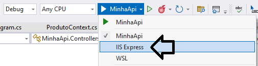
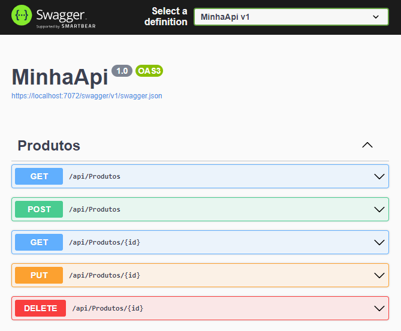

# datadog-hello-world

Gravação de LOGs e métricas no Datadog, utilizando uma API em .net 6.


# Instruções

Após o cadastro no Datadog, você receberá uma chave hexadecimal. A mesma deve ser registrada como Variável de Ambiente (não queremos dados sensíveis por aqui 😛).
```
// git bash
$> export DD_API_KEY=aaaabbbbccccddddeeeeffffgggghhhh
```

Para validar se o cadastro foi realizado com sucesso:

```
// git bash
$> echo $DD_API_KEY
```

Abra a solution [MinhaApi.sln](MinhaApi/MinhaApi.sln)  Visual Studio e inicialize no modo "IIS Express"...




... para visualizar a API no Swagger:



Você poderá interagir com a API via interface Swagger, ou importar a [collection Insomnia](insomnia.json). 

Prefira o uso do Insomnia, pois já possui todos os cenários possíveis de exemplo, e irá interagir de forma mais completa com o tutorial em vídeo.


## LOGs x Métricas

Nesta demonstração, estamos apenas utilizando as funcionalidades de LOGs e Métricas. Em poucas palavras, o básico de Datadog, para que você possa experimentar e entender o mecanismo de monitoração em uma aplicação.

APM, Treshold, Troubleshooting, Tracing, etc, não está contemplado por aqui.

Voltando ao tema principal, <kbd><span style='color:yellow'>LOG</span></kbd> se refere todo o aparato de request e response que uma aplicação pode fornecer (dados do cliente, JSON de resposta da API, quantidade de registros, etc) e que podemos exportar para um arquivo texto para uma consulta futura, enquanto <kbd><span style='color:yellow'>Métricas</span></kbd> corresponde a comportamentos da aplicação (tempo de resposta, status_code, memória, cpu, etc).

Em poucas palavras, ...
- LOG pertence ao usuário/cliente
- Métrica pertence a aplicação


### Utilizando TAGs
Informações de ambiente, nome do servidor, nome da aplicação podem ser "tagueadas" no Datadog.

Basta adicionar a propriedade "ddtags" no request:
```
payload.Add("ddtags", "env:production,host:SRV010AWS,source:api,service:Produtos");
```
E para adicionar os status Information/Warning/Error:
```
payload.Add("status", "info"); // Information
payload.Add("status", "warn"); // Warning
payload.Add("status", "error"); // Error
``` 